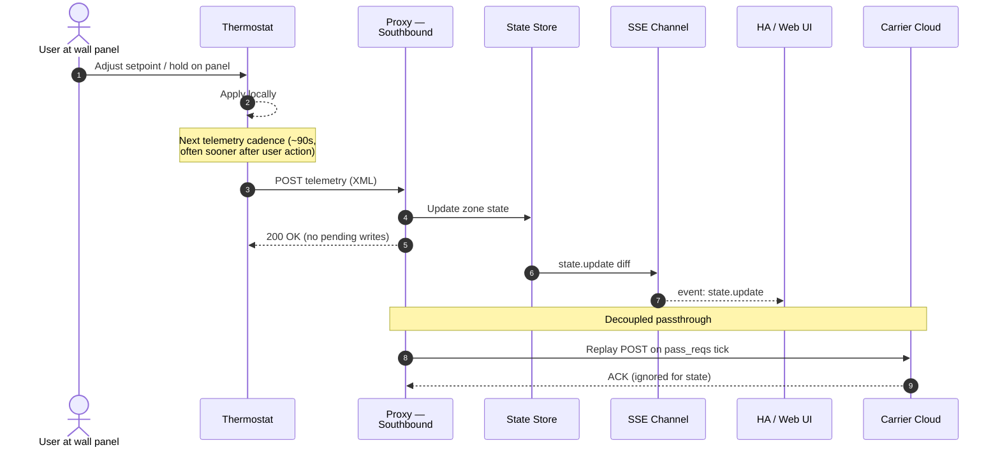
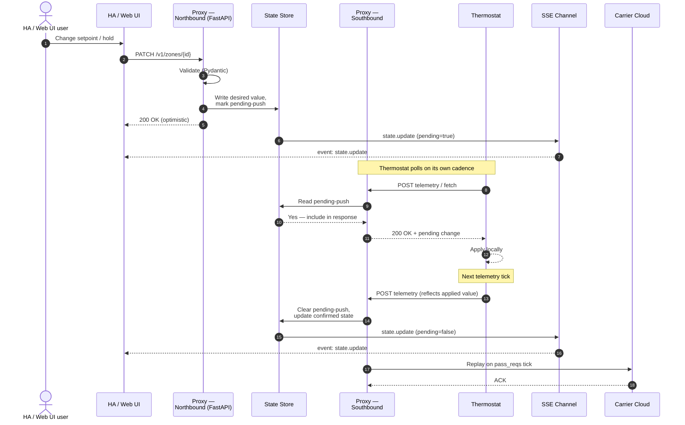
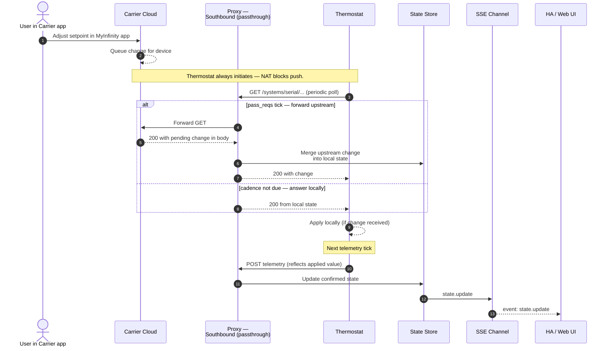
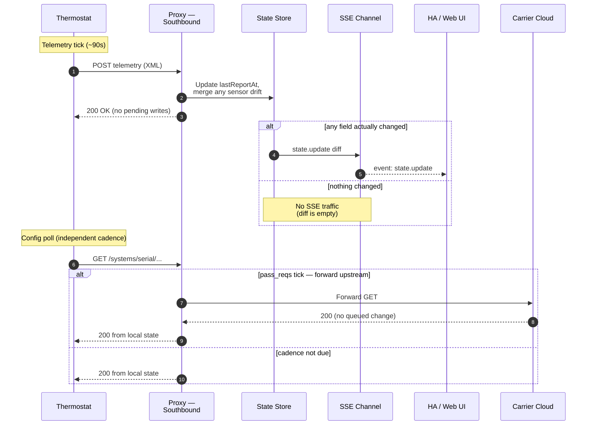

# Infinitude Modern Proxy — Design Document

Status: **Draft / proposal**
Target branch: `design/openapi-rewrite`
Companion: [`openapi.yaml`](./openapi.yaml)

---

## 1. Summary

Replace the existing Perl/Mojolicious Infinitude proxy with a Python service that:
- Retains 100% of the thermostat-facing protocol and Carrier cloud passthrough behavior (non-negotiable).
- Exposes a first-class, OpenAPI-described northbound HTTP API for the HA integration and web UI.
- Ships as a Home Assistant add-on (Docker/Python), with the current modern web UI as the only user interface.
- Drops the RS485/serial_tty code path entirely — network only.
- Drops the legacy `native.html` UI (Infinitude's original Perl-rendered pages).
- Exposes a comprehensive `/healthz` endpoint for diagnostics.

The rewrite is primarily a **northbound API modernization** plus a **language migration**. Thermostat compatibility is preserved by re-implementing exactly the southbound request/response shapes the thermostat expects.

---

## 2. Goals

1. **API clarity** — typed resources, flat JSON, no XML::Simple array-wrapped scalars, explicit error model.
2. **Schema contract** — OpenAPI 3.1 is the source of truth; Pydantic models generated from / validated against it.
3. **Shared types** — one Pydantic model set used by both the add-on and the HA integration, eliminating today's hand-typed field parsing in `coordinator.py`.
4. **Observability** — structured logs, health probe, metrics hooks, stale-data detection surfaced in the API.
5. **Live updates** — Server-Sent Events channel so the HA integration and web UI can subscribe to state changes instead of 30-second polling.
6. **Thermostat compatibility** — drop-in replacement: point existing thermostat DNS at the new add-on, no reflashing required.

## 3. Non-goals

- **Serial / RS485 connectivity.** Dropped. Network-only installations are the documented path.
- **Infinitude native UI.** Dropped. The modern HTML UI (`infinitude/infinitude-ui.html`) becomes the sole UI.
- **Backwards-compat with legacy `/api/*?mode=...` query-string endpoints.** The old endpoints are removed; the HA integration updates to the new API in the same release cycle. No dual-stack period.
- **Multi-thermostat support.** Single thermostat per proxy instance, same as today.
- **Non-Home-Assistant consumers.** The API is public and documented, but we do not commit to stability beyond the OpenAPI contract.

## 4. Architecture

```
                                  ┌──────────────────────────────────────┐
                                  │ Home Assistant host                  │
 ┌──────────────┐                 │                                      │
 │ Thermostat   │  POST telemetry │  ┌──────────────────────────────┐    │
 │ (Carrier/    │────────────────▶│  │  Add-on: infinitude-proxy    │    │
 │  Bryant)     │◀────────────────│  │  (Python / FastAPI / aiohttp)│    │
 └──────────────┘  response XML   │  │                              │    │
         ▲                        │  │  ┌────────────────────────┐  │    │
         │                        │  │  │ Southbound: thermostat │  │    │
         │                        │  │  │ XML request handler    │  │    │
         │                        │  │  └────────┬───────────────┘  │    │
         │                        │  │           │ cache             │    │
         │                        │  │  ┌────────▼───────────────┐   │    │
         │ passthrough            │  │  │ In-memory state + SQLite│◀─┼────┼─── HA integration
         │ (pass_reqs cadence)    │  │  │ persistence            │   │    │    (HTTP + SSE)
         │                        │  │  └────────┬───────────────┘   │    │
         │                        │  │           │                    │    │
         │                        │  │  ┌────────▼───────────────┐   │    │
         ▼                        │  │  │ Northbound: OpenAPI    │◀──┼────┼─── Web UI (same pod,
 ┌──────────────┐   HTTPS         │  │  │ (FastAPI router)       │   │    │    /ingress path)
 │ Carrier      │◀────────────────│  │  └────────────────────────┘   │    │
 │ cloud        │                 │  │                              │    │
 └──────────────┘                 │  └──────────────────────────────┘    │
                                  └──────────────────────────────────────┘
```

### 4.1 Component responsibilities

| Component | Responsibility |
|---|---|
| **Southbound handler** | Accepts thermostat HTTP POSTs, decodes Carrier's XML payloads, updates in-memory state, returns the XML responses the thermostat expects. Exactly matches upstream Infinitude's wire protocol. |
| **Passthrough scheduler** | On the cadence configured by `pass_reqs`, replays the last thermostat request to Carrier's cloud and records the response. This is transparent to both the thermostat and the northbound API. |
| **State store** | In-memory Python dataclasses / Pydantic models as the hot path; SQLite snapshot for restart continuity. Persists only the latest known state (no history). |
| **Northbound API** | FastAPI app implementing the OpenAPI spec. Reads from the state store for queries; writes to the state store AND schedules a "push to thermostat" for mutations. |
| **SSE channel** | `GET /v1/events` streams state deltas so consumers don't have to poll. |
| **Web UI** | Served from the same FastAPI process under `/` (or HA ingress). Static assets only — all logic lives client-side and hits the same northbound API. |
| **Health probe** | `GET /v1/healthz` returning component-level status (see §8). |

### 4.2 Data flow — read

1. Thermostat POSTs status every ~90s (Carrier's fixed cadence).
2. Southbound handler parses and writes to state store.
3. State store emits a diff to the SSE channel.
4. HA integration either receives the SSE event or polls `/v1/state` on its own cadence.

### 4.3 Data flow — write (setpoint, hold, schedule)

1. HA integration or web UI PATCHes a resource (e.g. `PATCH /v1/zones/1`).
2. API validates against the Pydantic model; a `mutate_config(fn)` helper edits the in-memory `<config>` tree in place (Slice 2+).
3. State store marks `config_dirty=true` AND enqueues a typed row in `pending_writes` (kind/target/payload) so the write survives restart.
4. On the next status POST from the thermostat, the directive response flips `configHasChanges=true` and shortens `pingRate` from 12 → 20 s. The dirty flag is cleared **optimistically in the same handler** (upstream Perl behavior).
5. Thermostat follows up with `GET /systems/{serial}/config`; we serve the mutated tree. Any rows in `pending_writes` for this serial are marked `applied_at=now()` — **pull-observed** semantic: we take "thermostat pulled the config" as proof the edit landed, rather than waiting for an echo in a later telemetry POST.
6. State store emits a diff to SSE.

**Pull-observed vs confirmation:** Earlier drafts of this spec called for clearing pending only when the thermostat echoed the new value in its next telemetry POST. We chose pull-observed for two reasons:
- A typed-payload → expected-telemetry-field map is laborious to build and kind-specific.
- Telemetry elides many config fields (schedules, vacation targets, per-activity setpoints). "Confirmation" can never arrive for those — the flag would pile up.

A confirmation upgrade path remains in the backlog; pull-observed is adequate for the failure modes Slice 2 handles (see §11.3).

This matches how upstream Infinitude operates — we inherit Carrier's "thermostat pulls changes" model rather than trying to push.

### 4.4 Event flows per initiation source

Three distinct scenarios drive state change in the system. The proxy treats them differently on the way in but converges them on the way out — every confirmed change ends the same way: a telemetry POST from the thermostat, a state-store update, and an SSE event for subscribers.

**Key insight:** scenarios 1 (wall panel) and 3 (Carrier app) are indistinguishable from the proxy's perspective — both manifest as "thermostat reports new state via the next telemetry POST". Only scenario 2 (NB API) exercises the pending-push write path.

#### 4.4.1 Change initiated at the thermostat (wall panel)



#### 4.4.2 Change initiated via NB API (HA or Web UI)



#### 4.4.3 Change initiated at Carrier website / MyInfinity app

The thermostat is always the client — it sits behind residential NAT and Carrier has no way to push to it. Every Carrier-originated change sits in Carrier's queue until the thermostat's next poll retrieves it. In an Infinitude setup the thermostat only talks to the proxy; the proxy forwards polls upstream on its `pass_reqs` cadence, and Carrier's response to *those* forwarded polls is what carries the pending change back down.



Consequence: a change made in the MyInfinity app can take up to one `pass_reqs` interval (default 60s) plus one telemetry tick (~90s) to propagate through to NB API subscribers. This matches upstream Infinitude's behavior — it's a property of Carrier's polling protocol, not the proxy.

#### 4.4.4 Steady-state polling (no user action anywhere)

Most of the time, nothing is changing — the thermostat still polls on its protocol-defined cadence, and the proxy still has to answer. This is the base case that keeps `lastReportAt` fresh, feeds the `/v1/healthz` staleness probe, and catches sensor-driven drift (room temp, outdoor temp, humidity) that arrives without any user action.



Two independent cadences are at play: the thermostat's telemetry POST (~90s, Carrier-fixed) and its config GET (shorter, also protocol-driven). The `pass_reqs` tick gates only the upstream forwarding, not the reply to the thermostat — the thermostat always gets an answer promptly.

### 4.5 Passthrough rationale — why `pass_reqs` vs. always-forward

The proxy could, in principle, forward every thermostat request straight to Carrier and relay the response verbatim. It deliberately does not. Rate-limited passthrough (`pass_reqs`, default 60s) is an architectural choice, not a performance optimization:

1. **Local authority for writes.** The thermostat can't distinguish "response from Infinitude" from "response from Carrier" — it just consumes whatever the HTTP response body says. If every poll were forwarded verbatim, Carrier's cached view of config would overwrite any NB-initiated change the proxy is trying to push. By answering most polls from its own state store, the proxy gets to inject pending writes into the response stream; Carrier's slower snapshot-driven view can't race it.
2. **Outage tolerance.** The thermostat polls constantly. If Carrier is unreachable and every poll forwarded, the thermostat sees a stream of failures. With `pass_reqs`, only the cadence-gated requests depend on Carrier; local control keeps working through a cloud outage.
3. **Rate limiting Carrier.** A thermostat polls far more frequently than Carrier's cloud expects from a single device. Forwarding every request risks throttling or account flags upstream.
4. **Bandwidth and privacy.** Fewer upstream requests means less traffic and less of the user's HVAC data leaving the LAN.

**The deliberate tradeoff** is latency on Carrier-originated changes (see §4.4.3): a change from the MyInfinity app takes up to one `pass_reqs` interval plus one telemetry tick to reach NB subscribers. This is accepted as the cost of local-first operation. `pass_reqs` is exposed as a user-tunable option precisely so operators can shift that tradeoff if they weight freshness over local authority.

---

## 5. Technology choices

| Concern | Choice | Rationale |
|---|---|---|
| Language | **Python 3.12+** | Shared types with HA integration; large async HTTP ecosystem; HA add-on tooling friendly. |
| Web framework | **FastAPI** | OpenAPI-native, Pydantic v2 models, SSE via `sse-starlette`. |
| ASGI server | **uvicorn** | Standard, production-quality. |
| XML parsing | **lxml** | Fast, well-maintained, matches Carrier's XML verbosity. |
| Persistence | **SQLite via `aiosqlite`** | Single file, no ops burden, survives add-on restart. |
| Outbound HTTP (Carrier) | **httpx** | Async, HTTP/2 capable if Carrier ever upgrades. |
| Config | Pydantic Settings, env vars + add-on options file. |
| Packaging | HA add-on using `python:3.12-slim` base; multi-arch via buildx. |
| Testing | **pytest** + `pytest-asyncio` + `schemathesis` (OpenAPI property tests). |

Not chosen: Go and Rust — the northbound/southbound code is I/O bound, and Python keeps the door open to sharing code with the HA integration.

---

## 6. Data model

Key design decisions relative to the current upstream:

1. **No array-wrapped scalars.** `mode: "cool"` not `mode: ["cool"]`.
2. **Explicit types.** Temperatures are numbers, booleans are booleans.
3. **Datetime discipline.** All absolute timestamps are **ISO 8601 UTC with `Z` suffix** (`2026-04-17T22:30:00Z`). Only recurring schedule periods use wall-clock `HH:MM` local to the thermostat, since a weekly program has no meaningful date component. The two types are distinct schemas in the spec (`IsoDateTime` vs. `LocalWallTime`) so they cannot be confused.
4. **Stable IDs.** Zone IDs and activity IDs are strings with explicit patterns; schedule period IDs are `1..N` per day.
5. **Enums.** HVAC mode, activity, fan speed, hold type, conditioning state — all enumerated in OpenAPI and Pydantic.
6. **Separation of concerns:**
   - `System` — mode, outdoor temp, humidifier, `lastReportAt` (UTC ISO of most recent thermostat POST), diagnostic strings.
   - `Zone` — name, temps, setpoints, humidity, damper position (normalized to 0–100% from the thermostat's native 0–15), fan, hold, conditioning state.
   - `Activity` — setpoints & fan for a named activity (`home|away|sleep|wake|manual`).
   - `Schedule` — per-zone weekly program: 7 days × up to 5 periods each. Replaced atomically via a single `PUT`.
   - `Hold` — zone-level OR whole-house; `until` is either an ISO 8601 UTC datetime or `null` (indefinite).

Full schemas live in `openapi.yaml`.

---

## 7. API surface (summary)

Base path: `/v1`.

| Method | Path | Purpose |
|---|---|---|
| GET | `/v1/healthz` | Comprehensive health & freshness snapshot. |
| GET | `/v1/state` | Full aggregate state (system + all zones). |
| GET | `/v1/events` | Server-Sent Events stream of state changes. |
| GET / PATCH | `/v1/system` | System-wide settings (primarily HVAC mode). |
| GET | `/v1/zones` | List all zones. |
| GET / PATCH | `/v1/zones/{zoneId}` | Inspect / update one zone (setpoints, fan). |
| PUT / DELETE | `/v1/zones/{zoneId}/hold` | Set or clear a zone hold. |
| GET / PATCH | `/v1/zones/{zoneId}/activities/{activityId}` | Edit a named activity (setpoints, fan). |
| GET / PUT | `/v1/zones/{zoneId}/schedule` | Get or replace the weekly program for a zone. |
| PUT / DELETE | `/v1/system/hold` | Set or clear the whole-house hold. |
| GET | `/v1/config` | Add-on runtime config (pass_reqs etc.) — read-only. |
| GET | `/v1/version` | Build info: proxy version, API version, commit SHA. |

See `openapi.yaml` for full request/response shapes and error definitions.

### 7.1 Removed vs. legacy

| Legacy | Replacement |
|---|---|
| `GET /systems.json` | `GET /v1/state` (flattened, typed) |
| `GET /status.json` | `GET /v1/state` |
| `GET /Alive` | `GET /v1/healthz` (Carrier status is one field) |
| `PUT /api/config?mode=…` | `PATCH /v1/system` body `{ "mode": "cool" }` |
| `PUT /api/{zone}/hold?activity=…&until=…` | `PUT /v1/zones/{zoneId}/hold` body `{ "activity": "home", "until": "2026-04-17T19:00:00Z" }` |
| `PUT /api/{zone}/activity/{id}?htsp=…` | `PATCH /v1/zones/{zoneId}/activities/{activityId}` body `{ "heat": 68, "cool": 76 }` |
| `PUT /api/config/wholeHouse?hold=on&…` | `PUT /v1/system/hold` body `{ "activity": "away", "until": "2026-04-17T17:30:00Z" }` |
| `POST /systems/infinitude` (full config dump) | `PUT /v1/zones/{zoneId}/schedule` with structured body |
| `/native.html` | Removed. |

---

## 8. Health probe (`/v1/healthz`)

Returns HTTP 200 always (so external probes don't flip unnecessarily) — the body carries the verdict.

```json
{
  "status": "healthy | degraded | unhealthy",
  "timestamp": "2026-04-17T22:30:00Z",
  "components": {
    "thermostat": {
      "status": "healthy | stale | unreachable",
      "last_contact": "2026-04-17T22:29:42Z",
      "last_contact_age_seconds": 18,
      "expected_interval_seconds": 90,
      "stale_threshold_seconds": 300
    },
    "carrier_cloud": {
      "status": "healthy | degraded | unreachable | disabled",
      "last_success": "2026-04-17T22:28:01Z",
      "last_attempt": "2026-04-17T22:29:00Z",
      "last_error": null,
      "pass_reqs_interval_seconds": 60,
      "consecutive_failures": 0
    },
    "state_store": {
      "status": "healthy | degraded",
      "zones_tracked": 2,
      "pending_pushes": 0,
      "oldest_pending_push_age_seconds": null
    },
    "api": {
      "status": "healthy",
      "uptime_seconds": 3612,
      "active_sse_subscribers": 3
    }
  },
  "version": {
    "proxy": "2.0.0",
    "api": "v1",
    "commit": "abc1234",
    "built_at": "2026-04-01T12:00:00Z"
  }
}
```

`status` roll-up rules:
- `unhealthy` if thermostat is `unreachable` OR state_store is `degraded`.
- `degraded` if Carrier cloud is `unreachable` or `degraded`, OR thermostat is `stale`.
- Otherwise `healthy`.

---

## 9. Events (`/v1/events`)

Server-Sent Events, `Content-Type: text/event-stream`. Each event is a JSON patch-ish envelope:

```
event: state.update
data: {"resource": "zones/1", "changes": {"rt": 72, "zoneconditioning": "idle"}}

event: hold.changed
data: {"resource": "zones/1/hold", "state": "active", "activity": "manual", "until": "16:30"}

event: notifications.received
data: {"serial": "2013W000855", "count": 1, "events": [{"eventClass": "fault", "code": 16, "description": "..."}]}

event: health.changed
data: {"reason": "mutation_drift", "driftCount": 1, "events": [...]}
```

Subscribers reconnect with `Last-Event-ID` to resume. The server keeps a bounded ring buffer (200 events) of recent events; if the requested `Last-Event-ID` is older than the buffer's oldest entry, the server re-seeds with a fresh `state.snapshot` instead of replaying.

Initial connect: the server sends a `state.snapshot` event with the full current state, then incremental diffs.

Keepalive is emitted as an SSE comment line (`: ping\n\n`) every 15 s rather than as a named event, so it doesn't pollute the `EventEnvelope` enum — the `EventSource` API silently ignores it. Consumer side (HA coordinator, alpha.30+) uses 60 s `sock_read` timeout; 4 missed pings = link is dead, trigger reconnect.

Event types currently emitted:
- `state.snapshot` — on connect, and on `Last-Event-ID` gap.
- `state.update` — on every northbound mutation AND every thermostat status post (the latter with empty `changes` as a re-fetch hint).
- `hold.changed` — when zone or whole-house hold flips active/cleared.
- `notifications.received` — alpha.31. Thermostat notification batches (`POST /systems/{serial}/notifications`) fire on the stream as well as landing in the REST ring buffer at `/v1/notifications`. Consumers can use either; SSE delivers in ~1 s vs. waiting for a poll cycle.
- `health.changed` — fires on mutation-drift batches today; reserved for future health-monitor transitions (Carrier-cloud reachability flips, etc.).

---

## 10. Configuration

### 10.1 Add-on options (`config.yaml`)

| Option | Type | Default | Description | Change vs. today |
|---|---|---|---|---|
| `pass_reqs` | int (10-3600) | 60 | Seconds between Carrier cloud syncs. | Unchanged. |
| `log_level` | enum | `info` | `debug|info|warning|error`. | New. |
| ~~`serial_tty`~~ | — | — | — | **Removed.** |

### 10.2 HA integration config

Unchanged: one field, `host`, pointing at the add-on's base URL.

---

## 11. Persistence

Two concerns:

1. **State cache** — last known thermostat report. Persisted to SQLite so that immediately after add-on restart the northbound API can answer reads without waiting for the next thermostat POST. Single-row-per-serial table (`state_cache`) holding `config_xml`, `idu_xml`, `odu_xml`, and the dirty flag. Stored XML is the raw `<config>` subtree as served on `GET /systems/{serial}/config` — parser accepts both the POST-body shape (`<system><config>…`) and the serialized shape (bare `<config>`) so restore and live handling share one entry point.
2. **Pending writes** — mutations made via the API that haven't yet been picked up by the thermostat. Persisted in `pending_writes` (kind / target / payload_json / created_at / applied_at). On startup they remain queued; `mark_all_applied(serial)` fires when the thermostat pulls `/config` (pull-observed clear — see §4.3).

### 11.3 Known limitations

Deliberate trade-offs, not bugs:

1. **Thermostat-reboot race — FIXED.** If the proxy has pending writes and is restarted, then the thermostat reboots and POSTs its stale full config *before* ever fetching `/config`, the incoming tree would otherwise overwrite our mutations. `state_store.apply_config` now runs each unapplied `PendingWrite` through `REPLAY_REGISTRY` onto the incoming tree, re-derives the typed `SystemConfig`, persists the mutated bytes, and sets `config_dirty` so the next directive re-signals. Unknown `kind` values stay pending (forward-compat with newer mutation types that an older build doesn't know how to replay). Pending rows still clear on the pull-observed GET `/config`.
2. **Startup window.** Uvicorn opens the listening socket before FastAPI lifespan completes. A southbound POST landing between socket-open and `Persistence.open` writes to memory only; disk catches up on the next write. Narrow (sub-second) and self-healing.
3. **Mid-session SQLite write failures** (disk full, WAL lock timeout, permission change) are logged and swallowed — the in-memory update wins. The alternative (propagate to the southbound handler and return 500 to the thermostat) would desync the directive channel and risk a retry storm. On process restart the in-memory-only update is lost; the next successful write supersedes it.
4. **Pull-observed ≠ confirmation.** §4.3 details the trade.

No historical data is retained. Time-series metrics, if ever needed, belong in Prometheus / InfluxDB external to the proxy.

---

## 12. Testing strategy

1. **Contract tests** — `schemathesis` runs the OpenAPI spec against the live service; any 500 on a valid input is a failure.
2. **Protocol replay** — capture a suite of real thermostat POSTs (XML) from a development device, replay against the southbound handler, assert the response XML matches byte-for-byte (modulo timestamp fields).
3. **Golden fixtures** — store representative `systems.json` / `status.json` dumps from the legacy proxy; assert the new `GET /v1/state` produces the semantic equivalent.
4. **HA integration integration test** — existing integration's test suite runs against a `pytest-asyncio`-spun-up proxy.

---

## 13. Migration plan

Phases, each shippable independently:

1. **Phase 0 — Freeze legacy, tag final release** on the existing Perl proxy. (Done: v1.0.x is the reference.)
2. **Phase 1 — OpenAPI spec finalized.** (This branch.) Design doc + `openapi.yaml` merged to `main` behind a clear note that no runtime changes have happened. ✅
3. **Phase 2 — New add-on scaffolding.** New top-level `addon/` directory with FastAPI app, Dockerfile, southbound stubs, generated Pydantic models. ✅
4. **Phase 3 — Southbound re-implementation.** Thermostat POST handlers (`/status`, `/config` GET+POST, `/notifications`, `/idu_config`, `/odu_config`), SQLite persistence, replay dispatcher on proxy-restart/thermostat-reboot. ✅
5. **Phase 4 — Northbound write endpoints.** Holds (zone + whole-house), setpoints, activities, schedules, vacation, humidity, mode, service reminders, spec-shape SSE events. ✅
6. **Phase 5 — HA integration cutover.** ✅ `custom_components/infinitude_direct/` hits `/v1/*` for state, healthz, zones, activities, schedules, and whole-house hold. Integration ships on the same `2.0.0-alpha.x` train as the add-on. Legacy `/api/*?mode=…` code path is gone.
7. **Phase 6 — SSE push client.** ✅ The coordinator subscribes to `/v1/events` on startup and dispatches `state.snapshot` / `state.update` / `hold.changed` / `notifications.received` events to a debounced refresh. Reconnect with exponential backoff + `Last-Event-ID` resume. While SSE is connected, scheduled polling is suspended (the addon's 15 s keepalive ping is the heartbeat); on disconnect a 60 s heartbeat poll resumes immediately + a one-shot refresh fires to catch up. Tri-state Infinitude indicator dot reflects SSE state (green = live; yellow = polling-only; red = sensor unavailable).
8. **Phase 7 — Carrier cloud passthrough.** ✅ Two layers, full Perl Infinitude parity:
   - **`forward_proxy.ForwardProxy`** for explicit URL-encoded paths (`GET /http%3A//host/path`) — firmware OTA. Allowlist-gated `*.carrier.com` / `*.bryant.com`; redirect-following disabled to keep the host check authoritative.
   - **`carrier_bridge.CarrierBridge`** for implicit thermostat-bound traffic. Mirrors `/systems/{serial}/status`, notifications, IDU/ODU configs, boot-config to `https://www.api.ing.carrier.com/...` with `pass_reqs` cache TTL. On status-mirror, if Carrier responds with `serverHasChanges=true`, opens a 120 s `carrier_changes` window; the next `/systems/{serial}/config` GET serves Carrier's tree (carrying app-queued MyInfinity commands), schedules a forced re-sync at +60 s, then closes the window. When no local mutations are pending, the thermostat's status-POST response is Carrier's directive verbatim (with `pingRate` forced to the clean cadence) — that's what propagates `serverHasChanges=true` to the device.
   - Both directions land in the `capture_traffic` SQLite table when `/v1/debug/capture` is on, with `direction='carrier_out'` for the relay legs. Per-request INFO access log mirrors uvicorn's shape so all four legs (inbound thermostat, inbound HA, outbound bridge mirror, outbound forward proxy) sit in the same log stream.
9. **Phase 8 — Legacy add-on removed.** After a deprecation window (~2 releases), the Perl add-on is removed from the repo. ⏳

No dual-stack period is planned; the HA integration tracks the API version it knows. Because Phases 5 and 6 were telescoped onto the same alpha train as the add-on, both the add-on (`addon/pyproject.toml`) and the integration (`custom_components/infinitude_direct/manifest.json`) share a single version number (`2.0.0-alpha.x`) and are released together.

---

## 14. Risks & open questions

| # | Risk / question | Notes |
|---|---|---|
| 1 | **Carrier's XML protocol is undocumented.** We depend entirely on upstream Infinitude's reverse engineering. | Mitigation: port the upstream Perl handlers 1:1 to Python in Phase 3, don't try to "clean up" the XML handling. |
| 2 | **Passthrough to Carrier cloud may involve TLS pinning or custom certificates.** | Need to inspect upstream `pass_reqs` code path before Phase 3. Assume TLS is standard until proven otherwise. |
| 3 | **Thermostat firmware variability.** Different Infinity/Evolution firmware versions may send slightly different XML. | Mitigation: protocol replay tests using captures from multiple firmware versions. Ask community for captures in Phase 3. |
| 4 | **HA add-on restart** briefly drops the thermostat's HTTP connection. | Acceptable: the thermostat retries. Document the expected ~30s post-restart gap. |
| 5 | **SSE over HA ingress** may not work with all reverse proxies. | Fall back to polling is always available. |
| 6 | **Hold `until`: "forever" vs. omitted** | Normalize in the API: `until: null` = indefinite, `until: "<ISO 8601 UTC datetime>"` = timed (e.g. `"2026-04-17T19:00:00Z"`). Whole-house and zone holds behave the same. The southbound translator converts to/from the thermostat's native `HH:MM` using the thermostat's local timezone. |
| 7 | **`activity: "manual"` asymmetry** | Today, whole-house hold forbids `manual`. Clarified in OpenAPI enum: `system.hold.activity` enum omits `manual`. |
| 8 | **Thermostat serial number** | Currently surfaced via `systems.json`; the new API exposes it under `GET /v1/system`. |

---

## 15. Out-of-scope, but worth noting

- **Multi-user auth / RBAC** — not needed; the add-on runs on a trusted LAN and HA ingress handles auth.
- **GraphQL** — rejected. The domain is small and stable; REST + SSE is the right shape.
- **WebSockets** — considered and rejected. SSE is simpler, proxy-friendly, and fits the unidirectional server→client push pattern.
- **CLI tool** — could ship a thin `curl`-equivalent later, not in v2.0.

---

## 16. Resolved design decisions

The four open questions from earlier drafts have been answered:

1. **Repo layout — RESOLVED.** New top-level `addon/` directory holds the Python source + Dockerfile. Legacy `infinitude/` stays in place until removed in Phase 7. No renames.
2. **API versioning — RESOLVED.** Path-based (`/v1/`). All northbound routes live under that prefix.
3. **Hold `until` semantics — RESOLVED.** ISO 8601 UTC with explicit `Z` offset for all absolute datetimes, across both the API and SSE event payloads. `null` means indefinite. The southbound translator converts to/from the thermostat's native wall-clock format. Wall-clock `HH:MM` is retained **only** for recurring schedule periods, which have no date component.
4. **Schedule PUT atomicity — RESOLVED.** `PUT /v1/zones/{zoneId}/schedule` replaces the entire week in one atomic call. No per-day endpoint in v1.
